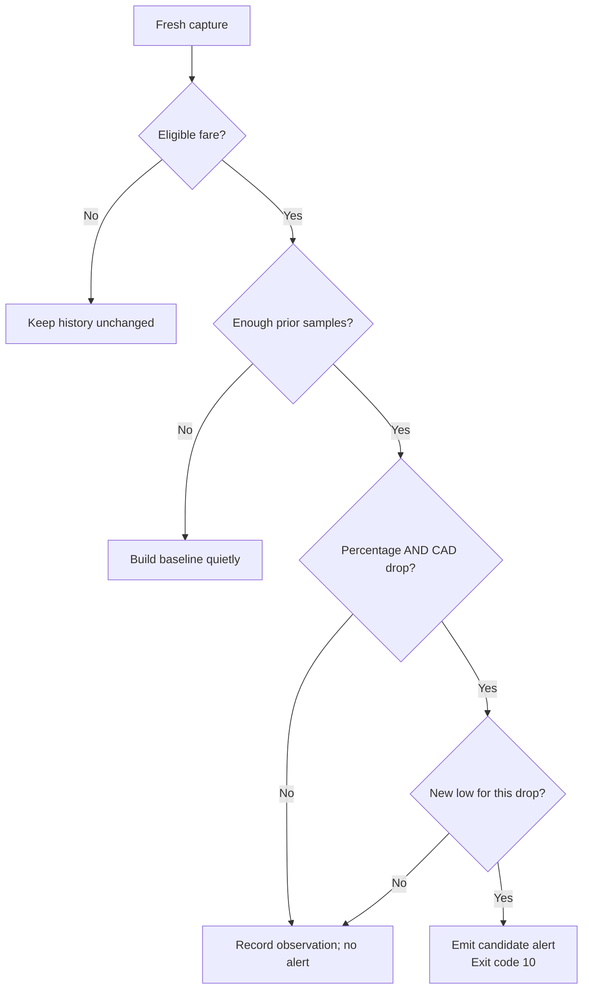

# Google Flights CLI

**Turn a browser search into a workflow you can run again.**

[](https://github.com/promptadvisers/google-flights-cli/actions/workflows/test.yml)


[](LICENSE)

Plan a route, let Codex inspect Google Flights, and keep the result as structured JSON and CSV. Change the dates, compare alternatives, or build a history that flags meaningful price drops.

The useful part is the repeatable path: known controls, explicit settings, stable fare cards, a reusable parser, and a checkable result.

> **Know the boundary:** fresh fares require the Codex desktop app with its computer-use plugin/tool and internal browser available in the active task. The CLI prints the browser instructions; Codex executes them. A terminal alone can plan searches, replay captures, export data and compare history. It cannot retrieve fresh fares with this adapter.

**[Try the offline demo](#try-it-in-30-seconds)** · **[Run a real search](#run-a-real-search)** · **[See the architecture](#how-it-works)** · **[Explore routes](docs/SEARCH-STRATEGIES.md)** · **[Troubleshoot](docs/TROUBLESHOOTING.md)**

## Try it in 30 seconds

Install Node.js 22 or later, then:

```sh
git clone https://github.com/promptadvisers/google-flights-cli.git
cd google-flights-cli
npm run demo
```

That's it. No `npm install`, API key or account is needed for this offline demo. Open the printed `flights.json` and `flights.csv` paths. The demo is clearly labeled **synthetic**; its fares and airlines are invented for testing.

## Run a real search

### 1. Make your request

```sh
npm run example
```

This writes an editable sample request with dates 90 and 97 days from today. Replace the example airports and dates with your own. The current adapter supports **business class, CAD, and 1-9 adults**. Other cabins, currencies, children and infants are rejected explicitly.

### 2. Give Codex the job

Open this repository in Codex desktop. Enable the computer-use tool/plugin if it is available to you, then paste:

```text
Read this repository's README and docs/BROWSER-RUNBOOK.md.

Run flight-search.mjs run using the request file I provide and a new
output directory. Use Codex's supported internal browser for the
browser steps printed by the CLI. Execute the initial browser call
alone and read the returned tool documentation before continuing.

Inspect each returned state. Let the shipped runner verify the
route, dates, adults, business cabin, CAD, and settled fare cards.
Return the JSON and CSV paths, retrieval time, and three useful
candidate fares. Explain what still needs itinerary verification.

If this task lacks the supported browser tool or local module
imports, report that requirement. Do not invent an alternative
connection to the browser. Search only; do not book.

Request file: <PATH_TO_REQUEST_JSON>
Output directory: <NEW_RUN_DIRECTORY>
```

Or have Codex run the exact command with **your future dates**:

```sh
node flight-search.mjs run \
  --from SFO --to JFK \
  --depart YYYY-MM-DD --return YYYY-MM-DD \
  --adults 1 --cabin business --currency CAD \
  --out runs/my-search
```

`YYYY-MM-DD` is a placeholder. `run` returning `requires_codex` is expected: it generated the plan successfully. The browser job still has to execute.

### 3. Inspect the result

```text
runs/my-search/
├── request.json          Your exact search settings
├── open-browser.js       Initial Codex browser instruction
├── advance-browser.js    Runner import and next step
├── run.json              Plan start and execution mode
├── capture.json          Timestamped browser evidence
├── flights.json          Structured, qualified fare candidates
├── flights.csv           Spreadsheet-ready results
└── metrics.json          Actions, observations and elapsed time
```

Use a fresh run directory for each search. Existing exports are never silently overwritten. Search output is local and ignored by Git.

## How it works


The browser runner receives a supported tab from Codex. It does not launch a separate browser, read a browser profile, attach through CDP, inspect cookies, or call private flight endpoints. Saved query plans contain local paths so the active Codex task can import the runner; those generated plans should stay private.

For a supported round trip, the normal path is one plan command followed by three browser tool calls. Extra loading or changed UI can require more inspection. The runner has a 12-call / 120-second budget and stops when evidence cannot be verified.

## What a fare actually means

| Field | Meaning |
| --- | --- |
| `price_total_cad` | Displayed round-trip **from-price for the whole adult party** |
| `price_per_adult_cad` | Party total divided by the requested adult count |
| `outbound_stops` / duration | Outbound leg only |
| `mixed_cabin_label` | Explicit mixed-cabin text found on the card |
| `self_transfer` | Explicit self-transfer or separate-ticket notice |
| `search_url` | Results-page link, not a guaranteed exact-itinerary link |
| `retrieved_at` | Original capture time, preserved during replay |
| `cabin_verified_all_segments` | `false` until separate detailed review |
| `return_flight_selected` | `false` for these initial results |

**An initial fare card is a candidate, not a booked or fully verified deal.** Select every leg and review cabin, transfers, baggage and total price before making a purchase decision. The absence of a warning label does not establish the absence of a restriction.

## Find meaningful price drops

After a successful fresh capture:

```sh
node flight-search.mjs check \
  --result runs/my-search/flights.json \
  --history history/prices.json \
  --drop-pct 20 --drop-cad 1000 \
  --min-samples 3 --lookback-days 30
```

Both thresholds must pass. The default compares the cheapest eligible route-level candidate against the median of at least three previous observations within 30 days. It filters explicit mixed cabins, transfers, more than two outbound stops and outbound durations above 40 hours.



Different dates, routes, adult counts and eligibility policies get separate baselines. Changing the dates is not a historical price drop. Duplicate captures are ignored. Captures more than 60 minutes old are rejected by the history checker.

The tool emits JSON; it does not send email, book flights or create a schedule. [Adapt the scheduled-task prompt](docs/SCHEDULED-TASK-PROMPT.md) only in an environment that exposes the required browser tool. Unattended scheduled retrieval has not been verified.

## Explore better route combinations

[Search strategies](docs/SEARCH-STRATEGIES.md) covers flexible dates, alternate airports, open jaws, multi-city itineraries and separate-ticket hypotheses.

| Capability | Status |
| --- | --- |
| Round-trip browser capture | Implemented; requires supported Codex browser |
| JSON/CSV replay and history checks | Standalone Node |
| Flexible-date / airport campaigns | Local planner plus ranking of captured observations |
| Two-leg open-jaw capture | Implemented with the manual browser runbook |
| Three-to-six-leg execution | Planned; live UI coverage not verified |
| One-way components | Planning only; ingestion rejects them |
| Automatic cheap-hub discovery | Not implemented; supply candidate airports |
| Economy, USD, award seats | Not implemented |
| Fully selected itinerary / booking | Not automated |

The planner counts omitted combinations and respects a shared search budget. Missing transport or hotel costs stay unknown; they never become zero by default.

## Command reference

| Command | Job | Browser needed? |
| --- | --- | --- |
| `run` / `plan` | Validate a request and print browser steps | To execute the returned plan |
| `search` | Plan a live search, or replay with `--capture` | For fresh retrieval |
| `ingest` | Validate a saved round-trip capture and export | No |
| `check` | Compare a fresh result with local history | No |
| `explore` | Generate a bounded search campaign | No |
| `trip-plan` | Plan a round trip, one-way or multi-city request | To execute the plan |
| `trip-ingest` | Import supported round-trip or multi-city evidence | No |
| `rank` | Compare captured campaign observations | No |

**Exit codes:** `0` success/quiet/baseline, `2` invalid input or failure, `3` `search` needs the Codex browser, `10` new price-drop candidate. `run` and `plan` exit `0` when planning succeeds, even though the returned status is `requires_codex`.

## Privacy, reliability and contributing

- No API keys, browser cookies, personal routes, real search captures or price histories ship in this repository.
- Tests and the demo use synthetic data. Runtime outputs can contain your travel details and machine paths; keep `runs/`, `history/` and captures out of public issues.
- This is an English Google Flights UI adapter. Website changes can break it. Report the failed check with a redacted example; never delete verification evidence just to make parsing pass.
- No universal speed claim: saved workflow knowledge can reduce repeated reasoning, while loading time and UI recovery still vary.
- No live network calls run during the test suite. CI tests Node 22/24 on Linux, macOS and Windows; this does not certify live browser support on all three.

```sh
npm test
```

See [contributing](CONTRIBUTING.md), [privacy notes](docs/PRIVACY.md), and the [MIT license](LICENSE). This is an independent Prompt Advisers project, not an official Google or OpenAI product.
