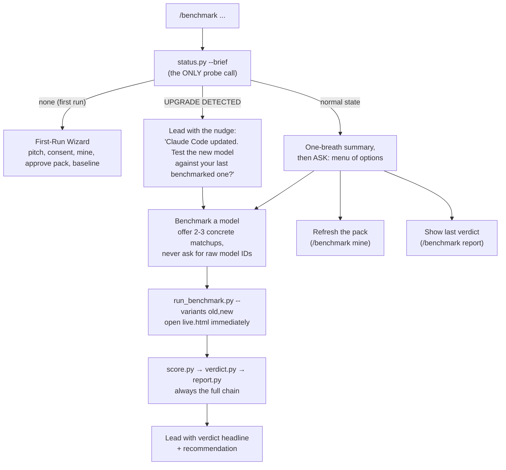

# AGENTS.md, read this first if you are an AI agent

This repo is a Claude Code skill called `/benchmark`. It mines a user's own Claude
Code conversation history into a frozen personal eval pack, replays that pack
headlessly against any Claude model or effort level, blind-judges the results, and
produces a verdict, an HTML report, and a share card.

## Which file do you need?

| You are... | Read |
|---|---|
| Operating the skill for a user (you ARE Claude Code running `/benchmark`) | [SKILL.md](SKILL.md). It is the canonical behavior spec: front-door flow, first-run wizard, dispatch table, voice rules, gotchas. Follow it exactly. |
| Explaining what this project is or installing it | [README.md](README.md) |
| Modifying the code, debugging a run, or reasoning about data files | [docs/ARCHITECTURE.md](docs/ARCHITECTURE.md) |

## The 60-second mental model

```
~/.claude/projects (user's real history, GBs of JSONL)
        |
        v  extract_history.py      (pure Python, local, no AI calls)
digest.json (a few hundred KB: unique prompts + corrections + metadata)
        |
        v  build_eval_pack.py      (LLM clusters into archetypes, freezes task cards)
eval_pack.json + archetypes.json   (the frozen personal benchmark)
        |
        v  run_benchmark.py --variants A,B[,C]   (headless `claude -p`, parallel, live.html)
runs/<run_id>/results.json + per-cell outputs + pack snapshot
        |
        v  score.py                (blind double-order judge + vibe check)
scorecard.md + verdicts in results.json
        |
        v  verdict.py              (Claude writes the TLDR)
verdict.json
        |
        v  report.py
report.html + share.html
```

State lives in `~/.claude/benchmark/` (`BENCHMARK_HOME` overrides it). Nothing in
that directory belongs in this repo.

## How the skill routes a `/benchmark` invocation

This is the front-door logic SKILL.md specifies, as a picture. One probe, then ask;
the bare command is a menu, never a report dump.



## Hard rules (violating any of these breaks the skill)

1. **Scratch/work dirs must live under the system temp dir, never under `~/.claude`.**
   Claude Code refuses to edit files inside its own config tree, silently, so every
   file-producing task fails if you put work dirs there. This was a real production
   bug; do not reintroduce it.
2. **The first variant passed to `run_benchmark.py` is the reference ("before").**
   Old model or lower effort always goes first. Scoring, verdicts, and reports all
   assume this ordering.
3. **The eval pack is frozen between mines.** Cross-run comparisons are only valid on
   the same `pack_version`. Every run dir carries its own `eval_pack.json` snapshot,
   and `score.py`/`report.py` read the snapshot, never the live pack.
4. **Never create `benchmark.db` without explicit user consent.** `db.py init` is
   consent-gated by design; everything else works without it.
5. **The judge protocol is not optional.** Both A/B orders per pair, winner derived in
   code, order disagreement = tie, judge sees produced files, all-model check failures
   are quarantined and disclosed. Do not "simplify" any of these; each one exists
   because a cheaper version produced wrong verdicts.
6. **User-facing language is non-technical.** SKILL.md carries a banned-jargon list
   (JSONL, SQLite, digest, headless, eval pack, ...). It applies to everything the
   user sees, wizard and beyond.
7. **No em dashes in any output**, including generated task cards (every card's
   deterministic checks include a no-em-dashes check tied to the prompt).
8. **Model IDs are a closed list** (see README). Never invent a variant id. Effort is
   expressed as a `@low|@medium|@high` suffix on a variant.
9. **After a run, always finish the chain**: `score.py`, then `verdict.py`, then
   `report.py`. The deliverable is the verdict, not raw tables.

## Quick health check

```bash
python3 scripts/status.py --brief   # one-line state: pack, latest run, upgrade detection
python3 scripts/status.py           # same as JSON (fields documented in the script docstring)
```

A safe end-to-end smoke test that cannot touch the user's real state:

```bash
export BENCHMARK_HOME=$(mktemp -d)
python3 scripts/extract_history.py
python3 scripts/build_eval_pack.py
python3 scripts/run_benchmark.py --variants claude-haiku-4-5-20251001 --tasks <one-task-id> --max-turns 8
python3 scripts/score.py && python3 scripts/verdict.py && python3 scripts/report.py
unset BENCHMARK_HOME
```

(Single variant runs work; there is just nothing to judge against, so scoring is a
no-op beyond checks. Use two variants to exercise the judge.)

## Known sharp edges

- `claude -p` cells can hit transient 529 overload errors; the runner retries. A task
  that times out (900s) on EVERY model is over-scoped, which is evidence about the
  task card, not the models.
- `pipe 2>/dev/null | tail` swallows exit codes; check them explicitly when chaining.
- LLM JSON responses are fence-stripped and validated; a malformed card generation is
  skipped, and the fix is simply re-running `build_eval_pack.py`.
- Fixture paths are contained to each scratch dir (absolute paths and `..` escapes
  are skipped with a warning). Task ids and variant labels are sanitized before
  becoming filenames. Candidate outputs are wrapped in data markers for the judge and
  verdict-begging is penalized. Keep all of that intact when editing.
