# /benchmark, Your History Is Your Benchmark

Stop asking "have you tried the new model?" Your own Claude Code history is the only
benchmark that matters: the tasks you actually do, judged by the standards you actually
hold. This skill mines your past conversations into a personal test suite, replays it
against any Claude model (or effort level) headlessly, and hands you a verdict.

> **AI agents:** if you were pointed at this repo to operate or understand it, start
> with [AGENTS.md](AGENTS.md). The canonical operating instructions are in
> [SKILL.md](SKILL.md). The internals and file schemas are in
> [docs/ARCHITECTURE.md](docs/ARCHITECTURE.md).

## Why this exists

A benchmark is only valid for the population it samples. Public benchmarks sample
someone else's task distribution: coding puzzles, exam questions, other people's
websites. Your Claude Code history is a perfect sample of YOUR task distribution,
complete with the follow-up corrections that reveal what you actually consider a good
answer. This skill turns that history into a frozen, repeatable eval pack, so the next
time a model drops you can answer "is it better FOR ME?" in about 20 minutes.

## Install

```
git clone <this repo> ~/.claude/skills/benchmark
```

(Or copy the folder there by hand.) Then, inside Claude Code:

```
/benchmark
```

First run walks you through a two-minute setup wizard. No API keys needed: everything
runs through the Claude subscription you already have. If a `GOOGLE_API_KEY` exists in
`~/.env` or the environment, the cheap mining/judging calls use Gemini Flash instead;
both engines work and produce the same artifacts.

Requirements: Claude Code installed and logged in, Python 3.9+, macOS or Linux.
No pip installs; the scripts use only the standard library.

## What it does

1. **Mine.** Reads your `~/.claude/projects` conversation history locally (pure
   Python, no AI calls), dedupes repeated automated prompts, and compresses ~GBs of
   transcripts into a small digest. An LLM then clusters that digest into the task
   categories you actually use AI for and freezes one representative test task per
   category. Your own past corrections become the grading rubric.
2. **Run.** Replays every task against the models you're comparing, in parallel,
   each in an isolated scratch session billed to your subscription (`claude -p`).
   A live grid page fills in as cells finish.
3. **Judge.** A blind referee scores each challenger against the reference twice
   (sides swapped, winner derived in code, disagreement = tie), sees the files each
   model actually produced, and quarantines tests that every model fails instead of
   charging them to the models. A separate blind vibe check scores soul, lecture
   factor, and padding with verbatim evidence quotes.
4. **Verdict.** Claude reads the scorecard and writes the TLDR: a headline, what
   changed behaviorally, per-category winners, and a plain recommendation. Plus a
   self-contained HTML report and a 16:9 share card.

```mermaid
flowchart LR
    H[("Your Claude Code history<br/>~/.claude/projects")] -->|extract_history.py<br/>local, no AI calls| D[digest.json]
    D -->|build_eval_pack.py<br/>LLM clustering| P[eval_pack.json<br/>frozen personal benchmark]
    P -->|run_benchmark.py<br/>headless claude -p, parallel| R[runs/run_id/<br/>results + artifacts + live.html]
    R -->|score.py<br/>blind double-order judge| S[scorecard.md]
    S -->|verdict.py<br/>one claude -p call| V[verdict.json]
    V -->|report.py| O[report.html + share.html]
```



## Commands

| Say | Get |
|---|---|
| `/benchmark` | Status + a menu of what to do next |
| `/benchmark mine` | Rebuild your test pack from recent history |
| `/benchmark opus-4.8 vs opus-5` | Head-to-head on your workload |
| `/benchmark opus-5@low vs opus-5@high` | Same model, different effort levels |
| `/benchmark opus-4.8 vs opus-5, 3 trials` | Stable majority-vote verdict (3x runtime) |
| `/benchmark building a website` | One-off ad-hoc task, authored on the spot |
| `/benchmark report` | The last verdict, again |
| `/benchmark demo` | The full experience against a throwaway state (for demos) |

## The pipeline, script by script

All scripts live in `scripts/` and share one state directory, `~/.claude/benchmark/`
(override with the `BENCHMARK_HOME` env var). Full flag reference and file schemas
in [docs/ARCHITECTURE.md](docs/ARCHITECTURE.md).

| Stage | Script | What it does |
|---|---|---|
| Probe | `status.py` | One-shot environment probe. `--brief` prints the human summary the skill opens with; bare prints JSON. |
| 1a | `extract_history.py` | History to digest. Local only, zero AI calls. |
| 1b | `build_eval_pack.py` | Digest to archetypes + frozen eval pack (LLM-assisted). |
| 2 | `run_benchmark.py` | Replays the pack against `--variants`, writes `runs/<run_id>/` with results, live view, and a pack snapshot. |
| 3 | `score.py` | Blind double-order judging + vibe check, writes `scorecard.md`. |
| 4 | `verdict.py` | The TLDR verdict via `claude -p`, writes `verdict.json`. |
| 5 | `report.py` | Renders `report.html` + `share.html` (16:9 card). |
| Memory | `db.py` | Optional consent-gated SQLite history (`init`, `record`, `state`, `summary`). |
| Shared | `llm.py` | Engine picker: Gemini Flash if a key exists, else Haiku via subscription. |

A full run is always the same chain, in order:

```bash
python3 scripts/run_benchmark.py --variants claude-opus-4-8,claude-opus-5
python3 scripts/score.py
python3 scripts/verdict.py
python3 scripts/report.py
```

The first variant is the reference ("before"); later variants are challengers.
Order matters: put the old model or lower effort first.

## Model IDs (verified, do not invent variants)

`claude-fable-5`, `claude-opus-5`, `claude-opus-4-8`, `claude-sonnet-5`,
`claude-haiku-4-5-20251001`. Effort suffix `@low|@medium|@high` maps to
`claude --effort`. Non-Claude models are not wired in yet.

## Honest limits

One run per task is a strong directional signal, not statistical proof; `--trials 3`
with majority voting is the answer when the verdict has to be defensible. The
benchmark measures first-pass headless behavior, not the feel of a long
back-and-forth session. Both caveats are stated in every verdict, on purpose.

## Privacy

Mining is local. The only data that leaves your machine is (a) short excerpts of your
own past prompts sent to the clustering/judging engine (Gemini or Claude, the same
kind of call you make every day) and (b) the benchmark tasks themselves during runs.
The SQLite memory file is created only after you explicitly say yes. Nothing in
`~/.claude/benchmark/` is ever committed to this repo.

## Repo map

```
SKILL.md               the operating instructions Claude follows (canonical behavior spec)
AGENTS.md              entry point for AI agents pointed at this repo
README.md              this file
docs/ARCHITECTURE.md   pipeline internals, data-file schemas, judging protocol, gotchas
scripts/               the pipeline (see table above)
```

Built by Mark Kashef ([Early AI-dopters](https://www.skool.com/earlyaidopters/about)).
