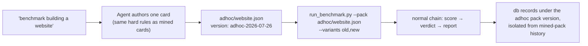
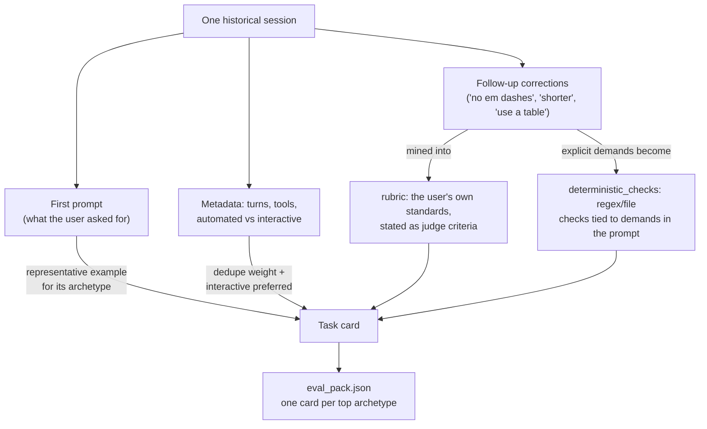
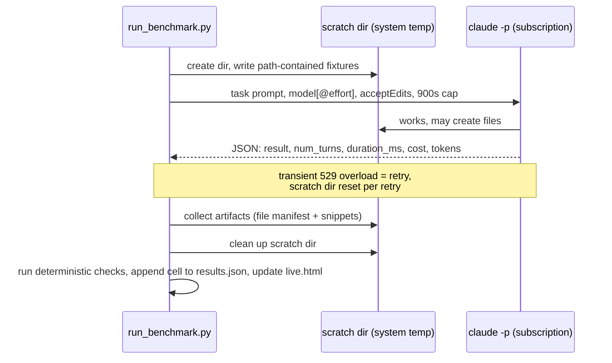
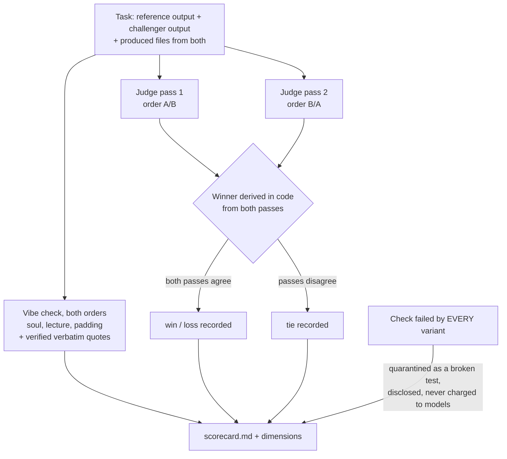
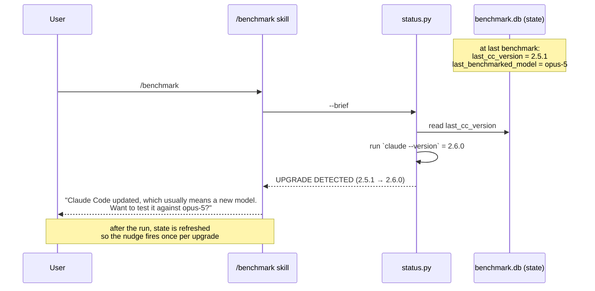
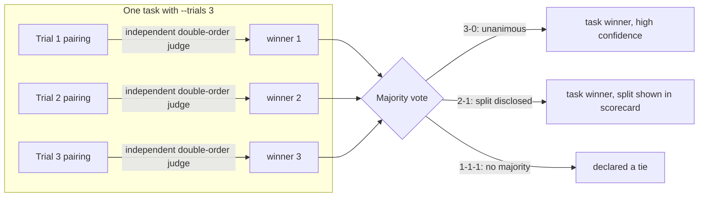

# Architecture and Data Formats

Everything an agent or developer needs to modify this skill, debug a run, or parse
its artifacts. Behavior rules for OPERATING the skill live in [SKILL.md](../SKILL.md);
this file covers internals.

## State directory

All state lives in one directory, resolved as `$BENCHMARK_HOME` if set, else
`~/.claude/benchmark/`. It is never committed to this repo.

```
~/.claude/benchmark/
  digest.json          compressed history (stage 1a output)
  archetypes.json      task-category distribution with subtasks (stage 1b)
  eval_pack.json       the frozen personal benchmark (stage 1b)
  benchmark.db         optional SQLite history, exists only after user consent
  adhoc/<slug>.json    one-off task packs authored on request
  runs/<run_id>/       one directory per benchmark run
  runs_archive/        smoke tests moved out of the way
```

### Ad-hoc packs (`adhoc/`)

When the user names a specific task instead of the mined pack ("benchmark building
a website"), the operating agent authors ONE card on the spot following the same
card rules, saves it as `adhoc/<slug>.json` with its own version
(`adhoc-<date>`), and runs the normal chain with `--pack`. Because the run
snapshots whatever pack it was given, scoring, verdict, and report work unchanged,
and ad-hoc results are recorded to the db under their own pack version so they
never mix with mined-pack history.



A `run_id` looks like `2026-07-26_094300_09a1_claude-opus-4-8-low_vs_claude-opus-5-low`:
timestamp, random suffix (collision-proofing), then sanitized variant labels.

Setting `BENCHMARK_HOME` to an empty directory gives a completely clean state (fresh
wizard, no pack, no db) while mining still reads the user's real
`~/.claude/projects`. That is how demo mode works; drop the env var to return to the
real store.

## Environment variables (complete list)

| Variable | Default | Used by | Effect |
|---|---|---|---|
| `BENCHMARK_HOME` | `~/.claude/benchmark` | all scripts | Relocates ALL state. Point at an empty dir for demo mode / clean-slate testing; real history is still read for mining. |
| `BENCHMARK_ENGINE` | auto | `llm.py` | Force `gemini` or `claude` instead of auto-picking (Gemini if a key exists, else Haiku via subscription). |
| `BENCHMARK_DAYS` | `120` | `extract_history.py` | History lookback window for mining. |
| `BENCHMARK_MAX_TASKS` | `8` | `build_eval_pack.py` | Cap on task cards in the pack (one per top archetype). |
| `GOOGLE_API_KEY` | none | `llm.py` | If present (env or `~/.env`), mining/judging use Gemini Flash. Never used for benchmark cells, which always bill the subscription. |

## Pipeline stages

### Stage 1a: `extract_history.py` (local, zero AI calls)

Walks `~/.claude/projects/**/*.jsonl`. Per session it keeps the first real user
prompt, a few follow-ups (where corrections live), tool/turn/token counts, and
whether the session was automated (SDK/cron) or interactive. Sessions with identical
first prompts are deduped into one entry with a `repeat_count`, so scheduled-agent
fleets don't drown the interactive workload; interactive examples are preferred as
the representative within a group. Env: `BENCHMARK_DAYS` (default 120) bounds the
lookback. Output: `digest.json`.

### Stage 1b: `build_eval_pack.py` (LLM-assisted)

Two phases through `llm.py`:

1. Cluster all unique prompts into 6-10 archetypes (with subtasks), weighted by
   repeats. Output: `archetypes.json` with names, share percentages, subtasks.
2. For each top archetype (cap: `BENCHMARK_MAX_TASKS`, default 8), freeze one task
   card: a representative prompt from real history, deterministic checks (each tied
   to an explicit requirement stated in the prompt), and a judge rubric mined from
   the follow-up corrections the user actually typed.

Output: `eval_pack.json`. If the LLM returns malformed JSON for a card, that card is
skipped; re-running the script is the fix.

The key idea in mining is that a session is more than its first prompt. The
follow-ups are where the user's real standards live: every "no, shorter", "you used
an em dash again", "table, not prose" is a grading criterion nobody wrote down as
one. Mining harvests those into the rubric:



Anatomy of a card, and why each rule exists:

- **Self-contained prompt.** Any needed input is inlined as `fixture_files`; a card
  that depends on live services or absent context measures the environment, not the
  model.
- **Bounded scope.** One deliverable, size-capped, finishes well under the 900s cell
  timeout. Over-scoped cards time out on every model and end up quarantine-adjacent
  (see gotchas): they produce zero information.
- **Checks tied to explicit demands.** A check may only test what the prompt
  actually asked for. Punishing a model for violating an unstated rule measures
  telepathy, not instruction following.
- **Rubric in the user's voice.** Judge criteria come from the user's own past
  corrections, so "quality" means quality as THIS user defines it.

### Stage 2: `run_benchmark.py`

```
--variants claude-opus-4-8,claude-opus-5@high   comma list of model[@effort]; FIRST is the reference
--tasks slug1,slug2                             subset of pack task ids (single-task head-to-heads)
--pack path.json                                alternate pack (ad-hoc tasks); snapshotted like any pack
--trials N                                      run every cell N times (default 1); enables majority-vote verdicts
--max-turns N                                   per-cell turn cap (default 25)
--parallel N                                    concurrent cells (default 3)
--model X --baseline Y                          legacy sugar for --variants Y,X
```

Each cell (task x variant x trial) runs headlessly via
`claude -p --permission-mode acceptEdits` with a 900s timeout, inside its own scratch
dir under the system temp dir (never `~/.claude`, see hard rule 1 in AGENTS.md).
Fixtures are written into the scratch dir first, path-contained (absolute paths and
`..` escapes skipped with a warning). Per-retry the scratch dir is reset. Cells run
in randomized order so no model always goes first. Transient API overloads (529) are
retried.

Captured per cell from `claude -p` JSON output: `result` text, `num_turns`,
`duration_ms`, `total_cost_usd`, `usage.output_tokens`, plus computed `words`,
wall-clock `elapsed_s`, deterministic `checks` results, and `artifacts` (file
manifests + snippets collected BEFORE the scratch dir is cleaned, so the judge can
see what each model actually built).

Lifecycle of one cell:



The run dir gets `live.html` immediately (a self-refreshing task x model grid; open
it to watch the run), `results.json` incrementally, per-cell `.md` outputs, and a
frozen `eval_pack.json` snapshot with a content hash so later re-mining can never
corrupt this run.

### Stage 3: `score.py [run_dir]` (defaults to newest run)

Blind judging of every challenger against the reference, per task, via `llm.py`.



Reliability protocol, all mandatory:

- Both A/B orders are judged per pair; the winner is derived in code from the two
  scored passes; order disagreement counts as a tie.
- The judge sees the artifacts each side produced, not just the final chat message.
  Candidate outputs are wrapped between data markers and verdict-begging text inside
  them is penalized; malformed judge responses are skipped, not fatal.
- Checks that EVERY variant fails are quarantined as broken tests (non-mutating: the
  pack is untouched, quarantine is recorded in results and disclosed in the report).
- Pairs that could not be judged (a model produced nothing) are listed as
  reliability failures, not silently dropped.
- A separate blind VIBE CHECK scores intangibles per pair, both orders: soul (person
  vs corporate manual), lecture factor (moralizing, judgmental hedging), padding
  (filler), each with verbatim evidence quotes that are verified to actually appear
  in the transcript.
- With `--trials N` at run time, each trial pairing is judged independently and task
  winners are majority votes with the split disclosed (unanimous vs split 2-1-0);
  metrics are medians across trials.

Output: `scorecard.md` (with an At-a-glance table), verdicts and dimension scores
merged into `results.json`, and the run recorded to the SQLite db if it exists.

### Stage 4: `verdict.py [run_dir] [--model claude-sonnet-5]`

Feeds the whole scorecard to Claude via one `claude -p` call and gets a structured
verdict back: headline, bottom line, behavior deltas, per-category winners,
recommendation, caveat. Prepends it to `scorecard.md` and writes `verdict.json`.

### Stage 5: `report.py [run_dir]`

Renders `report.html` (self-contained, light palette, verdict as hero block,
side-by-side outputs with metric chips, rubric, quarantine and unjudged-pair
disclosures, collapsible transcripts, J/K keyboard nav) and `share.html` (a 16:9
big-type verdict card for screen recording).

### Support: `status.py`, `db.py`, `llm.py`

- `status.py` prints a JSON env probe (fields in its docstring); `--brief` prints
  the short human summary the skill's front door uses. It never writes anything.
- `db.py` is the consent-gated SQLite store: `init` (only after user says yes),
  `record <run_dir>`, `state get/set <key>`, `summary`. Enables "vs your last N
  benchmarks" and Claude Code upgrade detection (`cc_version` vs `last_cc_version`).
The db is what turns isolated runs into a longitudinal story. It stores per-run
metrics and verdicts keyed by pack version, plus a small state table
(`last_benchmarked_model`, `last_cc_version`). Upgrade detection works like this:



Without the db (user declined), everything still works; runs just aren't remembered
across time and the upgrade nudge never fires.

- `llm.py` picks the cheap engine: Gemini Flash (`gemini-3-flash-preview`) when a
  `GOOGLE_API_KEY` is found in env or `~/.env`, else Claude Haiku through the user's
  subscription via `claude -p`. Force with `BENCHMARK_ENGINE=gemini|claude`. All
  calls are JSON-mode with fence stripping. Benchmark CELLS always run on the
  subscription regardless of engine; the engine only handles mining and judging.

## Data formats (as they exist on disk, verified against real runs)

### `eval_pack.json`

```jsonc
{
  "version": "2026-07-25+trim1",      // pack identity; cross-run comparisons need equal versions
  "source_stats": { ... },            // where the pack came from (counts, date range)
  "tasks": [
    {
      "id": "copywriting-video-launch",       // slug, used in --tasks and results keys
      "archetype": "Content Strategy",         // category name from archetypes.json
      "prompt": "...",                         // self-contained; fixtures inlined or listed
      "fixture_files": { "name.md": "..." },  // written into the scratch dir before the run
      "deterministic_checks": [                // each tied to an explicit demand in the prompt
        { "type": "regex_absent", "pattern": "—", "label": "no em dashes" }
        // other types: regex_present, file_created, ...
      ],
      "rubric": ["...", "..."],               // judge criteria mined from the user's corrections
      "share_pct": 18                          // this category's share of the user's workload
    }
  ]
}
```

### `runs/<run_id>/results.json`

```jsonc
{
  "run_id": "...",
  "variants": ["claude-opus-4-8@low", "claude-opus-5@low"],  // [0] is the reference
  "pack_version": "2026-07-25+trim1",
  "pack_hash": "...",                 // content hash of the pack snapshot
  "trials": 1,
  "tasks": {
    "<task_id>": {
      "<variant>": {
        "result": "...",              // final chat text
        "num_turns": 3, "duration_s": 42, "cost_usd": 0.0,
        "output_tokens": 2742, "words": 950, "elapsed_s": 44,
        "is_error": false,
        "artifacts": [ ... ],         // files the model produced (manifest + snippets)
        "checks": [ ... ],            // deterministic check outcomes
        "trials": [ ... ]             // per-trial cells when --trials > 1
      }
    }
  },
  "quarantine": [ ... ],              // checks failed by every variant (broken tests)
  "dimensions": {                     // per-variant rubric aggregates, filled by score.py
    "<variant>": { "quality": 6.0, "fidelity": "100%", "avg_tokens": 2742,
                   "quality_per_1k_tokens": 2.19, "speed_s": 42, "turns": 3.0,
                   "soul": 3.5, "lecture": 1.0, "padding": 5.0 }
  },
  "verdicts": {                       // per task|variant challenger outcomes, filled by score.py
    "<task_id>|<variant>": { "outcome": "loss", "score": 4.3, "ref_score": 6.0, "note": "..." }
  }
}
```

### `runs/<run_id>/verdict.json`

```jsonc
{ "headline": "...", "bottom_line": "...", "behavior": ["..."],
  "category_winners": { ... }, "recommendation": "...", "caveat": "..." }
```

## The definition of "better"

Two families of measurement, kept separate on purpose, plus the intangibles. These
are exactly the keys in `results.json` → `dimensions.<variant>`:

| Family | Dimension | Key | How it's measured |
|---|---|---|---|
| Ends | Quality | `quality` | Mean blind-judge rubric score across tasks (0-10) |
| Ends | Fidelity | `fidelity` | Deterministic check pass rate (instruction following) |
| Costs | Tokens | `avg_tokens` | Mean output tokens per task (verbosity/cost proxy) |
| Costs | Token efficiency | `quality_per_1k_tokens` | Quality bought per 1k output tokens |
| Costs | Speed | `speed_s` | Median wall-clock seconds per task |
| Costs | Autonomy | `turns` | Mean turns used (fewer = more autonomous) |
| Vibes | Soul | `soul` | Person vs corporate manual (0-10, judged with quotes) |
| Vibes | Lecture factor | `lecture` | Moralizing and judgmental hedging (lower is better) |
| Vibes | Padding | `padding` | Filler and throat-clearing (lower is better) |

Ends answer "did it do the job, to the user's own standards?" Costs answer "what did
the job cost?" Vibes answer "would you want to live with it?" The verdict weighs all
three in plain words; a model can win more tasks and still lose the recommendation
on cost, which is precisely the kind of verdict public benchmarks never give.

## Confidence model

One trial per task is a directional signal. Judge variance is real: the same run
scored twice can flip a close verdict (this happened in practice and is why trials
exist). `--trials 3` is the publishable form: every cell runs three times, each
trial pairing is judged independently, and the task winner is a majority vote with
the split disclosed. Metrics are medians across trials.



Every verdict states its confidence caveat (one run = directional, not proof; the
benchmark measures first-pass headless behavior, not long-session feel). Keep it
that way; honesty about confidence is a feature of the product.
