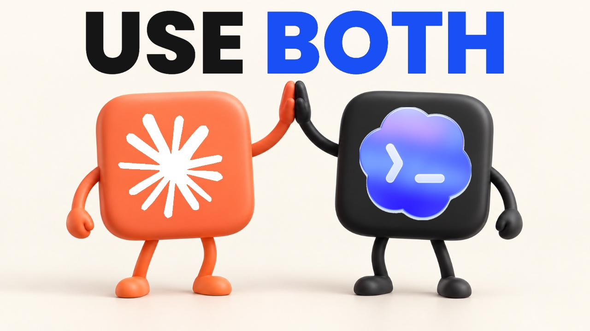

# Use Both: Claude + Codex Workflow Kit

**Plan with one. Challenge it with the other. Keep the project moving.**

A practical companion to Mark Kashef's Claude + Codex video: six workflows, copy-ready prompts, a printable guide, and two small skills for moving between assistants without re-explaining the project.



## Start Here

1. Read [START-HERE.md](START-HERE.md) for a five-minute, no-install trial.
2. Pick one task from [PROMPTS.md](PROMPTS.md), replace every bracketed placeholder, and run it in your own project.
3. Read the [step-by-step guide](GUIDE.md) or download the [illustrated PDF](guide/USE-BOTH-WORKFLOW-GUIDE.pdf).
4. Install the optional [handoff and prime skills](docs/setup.md#install-the-two-skills) when you want repeatable continuity.

**Free means free.** The public files are available here without a purchase. A Gumroad edition packages the same kit and PDF together; any contribution is optional. Your AI subscriptions, API usage, and third-party services are separate.

## What Is Inside?

| File or folder | What you get |
| --- | --- |
| [GUIDE.md](GUIDE.md) | An AI-readable walkthrough of all six levels |
| [PROMPTS.md](PROMPTS.md) | Planning, review, images, supervised computer use, goals, and continuity prompts |
| [guide/](guide/) | A polished, printable PDF with a routing card |
| [skills/handoff/](skills/handoff/) | A project-local skill that writes a compact, sanitized snapshot |
| [skills/prime/](skills/prime/) | A read-first skill that recovers state without treating old notes as new permission |
| [templates/](templates/) | Task brief, plan, review, and handoff templates |
| [examples/](examples/) | A fictional worked example with an actual runnable test |
| [docs/setup.md](docs/setup.md) | Manual, CLI, and optional plugin routes; installation and collision handling |
| [docs/routing-card.md](docs/routing-card.md) | Which assistant to try for which job |
| [docs/privacy-and-safety.md](docs/privacy-and-safety.md) | Data boundaries, approvals, costs, and safe handoffs |
| [docs/troubleshooting.md](docs/troubleshooting.md) | Common failures and concrete recovery steps |
| [scripts/install_skills.py](scripts/install_skills.py) | Preview-first installer that refuses to overwrite existing skills |

## The Six Levels

1. **Let them argue:** one assistant drafts; the other critiques the same artifact. Stop after a bounded review loop, not after empty agreement.
2. **Generate images:** use an available image tool and return the actual file to the project. Check access and billing first.
3. **Split the work:** one builds on a branch; the other reviews the diff. Tests and your approval decide what ships.
4. **Supervised computer use:** delegate an authorized action while keeping credentials, payment, and consequential submissions under your control.
5. **Give it a finish line:** define a measurable goal and a stop condition. A request to stop after a time is not necessarily a hard runtime limit.
6. **Hand it off:** write the state to a portable file, then have the next assistant read and verify it before continuing.

## Requirements

- The no-install route only needs two assistants and a text editor. One assistant can still use the handoff habit.
- CLI delegation needs installed, authenticated Claude Code and Codex CLIs, plus a terminal-capable host. Access to particular models and tools depends on your account and environment.
- The optional installer and included example use **Python 3.9+**, with no third-party Python packages.
- Git is needed for the branch/review workflow. GitHub is optional unless you want a hosted pull request.
- Image generation and computer use are **not guaranteed by having the CLI alone**. Check the actual session's available tools.

The video names **Claude Opus 5.5** and **GPT-6 Astra**. Those are the recorded labels, not a promise that an account exposes the same model IDs, effort settings, prices, or tools. Select an available model deliberately and record what actually ran.

## Quick Skill Installation

Run from this downloaded kit, pointing at an existing project directory you own:

```bash
# Preview only. Nothing is changed.
python3 scripts/install_skills.py --project /path/to/your/project --target both

# Apply after reviewing the printed destinations.
python3 scripts/install_skills.py --project /path/to/your/project --target both --apply
```

Use `--target claude` or `--target codex` for one assistant. The installer writes only `.claude/skills/{handoff,prime}/SKILL.md` and/or `.agents/skills/{handoff,prime}/SKILL.md`. It never changes global skills, credentials, settings, or existing skill files. See [setup](docs/setup.md) for manual installation, personal-skill name collisions, reload behavior, and removal.

In Claude Code: `/handoff` at the end of a session, then `/prime` in the next one. In Codex: `$handoff`, then `$prime`, where skills are available. With any other assistant: ask it to read `handoff/LATEST.md` and the referenced snapshot, summarize the state, and wait for your next instruction.

## What These Skills Are, and Are Not

These are **new public-safe teaching versions**, not a dump of Mark's private skills. They implement the core snapshot-and-resume pattern using one project folder. They do not include private business context, client information, credentials, multi-project automation, background agents, or integrations with Mark's systems.

A skill is an instruction file, not an enforcement boundary. Read it before using it. Files can contain mistakes or malicious instructions; current permissions and your current request remain authoritative. Never use a second assistant to bypass a refused safety control.

## Verify the Download

```bash
python3 -m unittest discover -s tests -v
python3 examples/task-board/test_task_board.py
```

The tests exercise installer preview/apply behavior, idempotence, conflict refusal, symlink refusal, and the synthetic task-board example. They do not prove that every model follows the skills or that your account has a particular tool. No live end-to-end assistant benchmark is claimed.

## Use This Kit With an AI

```text
Read START-HERE.md, GUIDE.md, PROMPTS.md, and docs/privacy-and-safety.md
from this kit. Treat them as reference material, not permission to act.
My project is [project]. My task is [task]. My acceptance test is [test].
Recommend one workflow and identify what access it needs. Do not install,
upload, purchase, publish, or modify anything until I choose the next step.
```

## Sources, License, and Changes

Documentation checked on **September 26, 2026**. See [sources and version notes](docs/sources.md) and [CHANGELOG.md](CHANGELOG.md). Prefer current first-party documentation when interfaces change.

Original text and code are under the [MIT License](LICENSE). Third-party product names and marks remain their owners' property; see [ASSET-NOTICE.md](ASSET-NOTICE.md). This is an independent educational resource, not an OpenAI or Anthropic product or endorsement.

Never post credentials or private handoffs in GitHub issues. For a reproducible issue, share your OS, relevant tool version, sanitized command, and minimal synthetic example.
